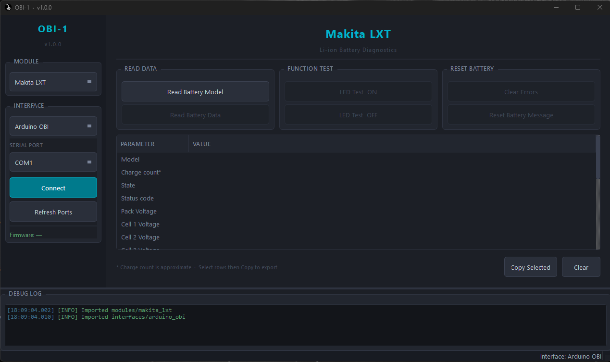

# Open Battery Information

This project aims to provide tools and information about various batteries in order to aid repair. 
It is very common for manufacturers to lock the BMS when a fault is detected to protect the device and the user. Very important feature!
So when is it a problem? Well, there is always a chance for false triggering of this protection, or the fault could have been temporary or even repaired. 
In this case it would be wasteful to throw out a perfectly good BMS just because its software says it is faulty.

This is the problem we would like to solve!



## Contact information

For any questions, please e-mail: openbatteryinformation@gmail.com

## Support

I have spent alot of time on this project and now releasing all this information to the public in hope that it will help other people save batteries and money. If you would like to show some appreciation for my work, please consider supporting me by buying me a coffee or sponsor me on Github!

[](https://www.buymeacoffee.com/mnhjansson)
---

# Instructions

## Step 1: Set Up ArduinoOBI

  1. Navigate to the ArduinoOBI folder in the project directory.
  2. Follow the instructions in the README.md. This section will guide you through configuring the Arduino part of the system, ensuring everything is set up correctly.

## Step 2: Set Up OpenBatteryInformation

After setting up the Arduino part, you have two options for setting up the software on your computer.

### Option 1: Use Precompiled Binary for Windows

If you prefer not to deal with Python dependencies, you can download a precompiled binary for Windows:

  1. Navigate to the Releases section of the repository.
  2. Download the Windows precompiled binary for your system.
  3. Simply run the executable and follow any on-screen instructions to use the software.

### Option 2: Install Python Requirements - Clone the Repository and Install Dependencies

  Clone the repository to your local machine:
```bash
git clone https://github.com/yourusername/OpenBatteryInformation.git
```
Navigate into the project folder:
```bash
cd OpenBatteryInformation
```
Install the required Python dependencies:

If you don't have pip installed, follow the installation guide for your platform here.
Install the required libraries by running:
```bash
pip install -r requirements.txt
```
You should now be ready to run OpenBatteryInformation!


## Step 3: Run OpenBatteryInformation

  If you installed the Python version, you can run the program by executing:
```bash
python main.py
```
If you're using the Windows binary, simply double-click the downloaded OBI.exe file to start the application.

---
