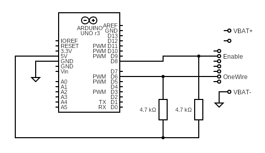

# Open Battery Information

This project aims to provide tools and information about various batteries in order to aid repair.
It is very common for manufacturers to lock the BMS when a fault is detected to protect the device and the user. Very important feature!
So when is it a problem? Well, there is always a chance for false triggering of this protection, or the fault could have been temporary or even repaired.
In this case it would be wasteful to throw out a perfectly good BMS just because its software says it is faulty.

This is the problem we would like to solve!

> [!IMPORTANT]
> **The desktop application is deprecated.**
>
> The old desktop application (Python/Tkinter) has been removed from this repository and is no longer
> maintained. It has been replaced by a new web-based UI that runs in your browser:
>
> - **Web UI / OBI-1 tool:** <https://github.com/OpenBatteryInformation/openbatteryinformation.github.io>
> - **Live site:** <https://openbatteryinformation.github.io/>
>
> The web UI connects to the Arduino over Web Serial and can even flash the firmware directly from your
> browser, so no Python installation is needed anymore.
>
> This repository now only hosts the **Arduino firmware** (see [`ArduinoOBI/`](ArduinoOBI/)).

## Contact information

For any questions, please e-mail: openbatteryinformation@gmail.com

## Support

I have spent alot of time on this project and now releasing all this information to the public in hope that it will help other people save batteries and money. If you would like to show some appreciation for my work, please consider supporting me by buying me a coffee or sponsor me on Github!

---

# Instructions

## Step 1: Set Up ArduinoOBI

1. Navigate to the `ArduinoOBI` folder in the project directory.
2. Follow the instructions in its `README.md`. This section will guide you through building and flashing
   the firmware to your Arduino Uno (or ESP32-C3), ensuring everything is set up correctly.

## Step 2: Flash the Firmware

You have two options for flashing the firmware onto your board:

### Option 1: Flash from the Browser (Recommended)

No toolchain required. Open the [firmware uploader](https://openbatteryinformation.github.io/firmware/uploader.html)
in Chrome or Edge, connect your board via USB and flash the firmware directly from your browser.

### Option 2: Build and Flash with PlatformIO

1. Install [VS Code](https://code.visualstudio.com/) and the
   [PlatformIO extension](https://platformio.org/install/ide?install=vscode).
2. Open the `ArduinoOBI` folder as a project in VS Code.
3. Build and upload the firmware for your board following the steps in `ArduinoOBI/README.md`.

## Step 3: Use the OBI-1 Tool

Once the firmware is running on your board:

1. Open the [OBI-1 web tool](https://openbatteryinformation.github.io/obi.html) in Chrome or Edge.
2. Connect to the serial port of your Arduino (or ESP32-C3).
3. Insert a battery and press **Read battery** to read model, cell voltages, temperatures, charge count
   and status.

Prebuilt firmware binaries (`uno.hex` / `esp32.bin`) are also attached to the
[Releases](https://github.com/mnh-jansson/open-battery-information/releases) page of this repository.

---
