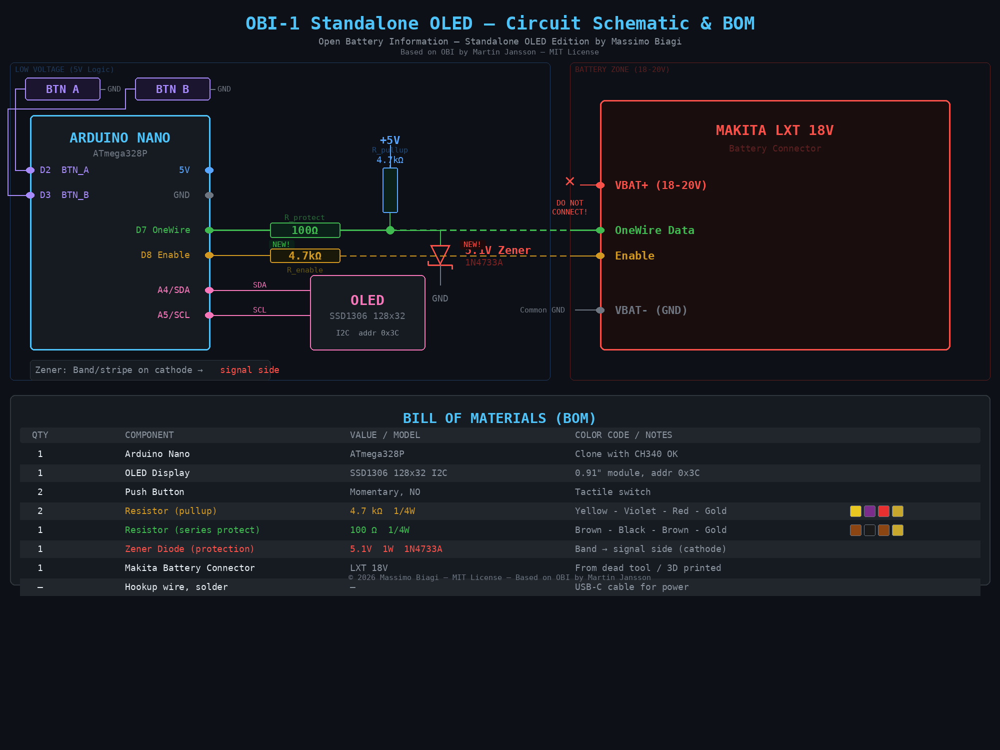

# OBI-1 Standalone OLED — Makita LXT Battery Tool

**Author: Massimo Biagi**

Standalone version of the [Open Battery Information](https://github.com/mnh-jansson/open-battery-information) project by Martin Jansson. Runs entirely on an Arduino Nano with an OLED display and 2 buttons — **no PC required**.

Power it with any USB-C power bank or charger, insert a Makita battery, and read diagnostics or reset errors on the spot.

## Features

| Menu Item     | Function                                          |
|---------------|---------------------------------------------------|
| Read Battery  | Reads model, ROM ID, charge count, cell voltages, temperatures, state — all in one step |
| LED ON        | LED functional test (turn on)                     |
| LED OFF       | LED functional test (turn off)                    |
| Clear Errors  | Reset BMS error flags                             |
| Reset Msg     | Reset battery message (work in progress)          |

## What It Reads

- **Model** — automatic battery identification
- **Pack voltage** — total pack voltage
- **Cell 1-5 voltage** — individual cell voltages
- **Voltage difference** — cell imbalance detection
- **Temperatures** — internal thermal sensors
- **Charge cycles** — total charge count
- **State / Errors** — BMS status code and locks
- **Capacity & type** — nominal Ah and battery type
- **Manufacturing date** — from ROM ID

## Circuit Schematic & BOM



### Bill of Materials

| Qty | Component               | Value / Model       | Notes                              |
|-----|-------------------------|---------------------|------------------------------------|
| 1   | Arduino Nano            | ATmega328P          | Clone with CH340 OK                |
| 1   | OLED Display            | SSD1306 128x32 I2C  | 0.91" module, addr 0x3C           |
| 2   | Push Button             | Momentary, NO       | Tactile switch                     |
| 2   | Resistor (pullup)       | 4.7 kΩ 1/4W        | Yellow-Violet-Red-Gold             |
| 1   | Resistor (series)       | 100 Ω 1/4W         | Brown-Black-Brown-Gold             |
| 1   | Zener Diode             | 5.1V 1W (1N4733A)  | Band/stripe → signal side          |
| 1   | Makita Battery Connector| LXT 18V             | From dead tool or 3D printed       |
| —   | Hookup wire, solder     | —                   | USB-C cable for power              |

### Wiring

```
Arduino Nano          Function              Connection
─────────────────────────────────────────────────────────
D2                    BTN_A input           Button to GND (internal pull-up)
D3                    BTN_B input           Button to GND (internal pull-up)
D7                    OneWire data          100Ω → junction → 4.7kΩ to 5V, Zener to GND
D8                    Battery enable        4.7kΩ pull-up to battery Enable pin
A4                    I2C SDA               OLED display
A5                    I2C SCL               OLED display
5V                    Power out             OLED VCC, pull-up resistors
GND                   Ground                Common ground for all components
```

### Protection Circuit

The OneWire line is protected against accidental overvoltage from the battery pack (18-20V):

```
                    +5V
                     |
                   [4.7kΩ]  R_pullup
                     |
D7 ───[100Ω]───────┬────────── OneWire Data (to battery)
      R_protect     |
                 Zener 5.1V
                 (1N4733A)
                    |
                   GND
```

- **100Ω series resistor**: limits current if a fault occurs
- **5.1V Zener diode**: clamps any voltage above 5.1V, protecting the Arduino
- **4.7kΩ pull-up**: standard OneWire pull-up to 5V

> ⚠️ **Zener orientation**: the band/stripe (cathode) goes towards the signal line, plain side towards GND.

> ⚠️ **NEVER connect VBAT+ (18-20V) to any Arduino pin.** Always verify resistor values with a multimeter before soldering.

### Button Controls

| Button | Short press        | Long press (>0.8s) |
|--------|--------------------|---------------------|
| **A**  | Next item / Scroll | Back to menu        |
| **B**  | OK / Execute       | —                   |

## Installation

1. Install **SSD1306Ascii** by Bill Greiman from Arduino Library Manager
2. Copy `OneWire2.h`, `OneWire2.cpp`, and `util/` folder into the sketch folder
3. Open `OBI_Standalone_OLED.ino` in Arduino IDE
4. Select Board: **Arduino Nano**, Processor: **ATmega328P**
5. Upload

## Translation

All user-visible strings are grouped at the top of the `.ino` file under the **LANGUAGE / LABELS** section. To translate to another language, simply change those `#define` and `PROGMEM` strings.

## Compatibility

Tested with Makita LXT 18V batteries with OneWire interface:

BL1815 · BL1820 · BL1830 · BL1840 · BL1850 · BL1860 · BL18xx series

## Demo

[](https://youtube.com/shorts/XOClaFdqzUA)

## License

MIT License — see [LICENSE.md](LICENSE.md)

Copyright (c) 2026 Massimo Biagi — Standalone OLED Edition
Copyright (c) 2024 Martin Jansson — Open Battery Information

This project is based on [Open Battery Information](https://github.com/mnh-jansson/open-battery-information) by Martin Jansson, released under the MIT License. The Standalone OLED adaptation is released under the same license.

As required by the MIT License, the original copyright notice and permission notice are preserved in all copies and substantial portions of the software.
